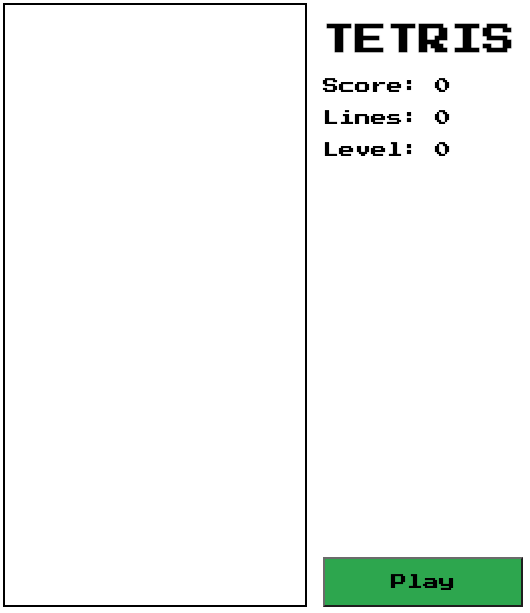

# Tetris

Tetris replica project

#### Date: Jan 12, 2023

### By: Kevin Blanco

#### [LinkedIn](https://www.linkedin.com/in/kevinjblanco/) | [GitHub](https://github.com/greensharpie)

### [GitHub - Backend](https://github.com/greensharpie/Door_Drop_Backend) | [Trello Board](https://trello.com/b/xrNp2Go1/door-drop#) | [Heroku App](TBD)

---

### **_Description_**

Tetris is a tile-matching puzzle game. The goal is to drop blocks, called tetrominos, down into a playing board to make horizontal lines. There are seven different types of tetrominos. Levels have a set number of lines to clear. When the goal number of lines are clearned the player moves to the next level. As levels go up, the tetrominos fall faster.

### **_Technologies_**

####

- HTML
- JavaScript
- CSS

---

### **_Screenshots_**

> #### **Landing Page**
>
> 

> #### **Restaurant Page**
>
> 

> #### **Restaurant Item Page**
>
> 

####

---

### **_Future Updates_**

####

- [ ] Local storage for score.
- [ ] Mobile friendly
- [ ] Bug - Certain pieces may extend beyond the boundaries when rotating close to the edges.

---

### **_Credits_**

####

#### Markdown Cheatsheet: [MarkdownGuide.org](https://www.markdownguide.org/cheat-sheet/)
